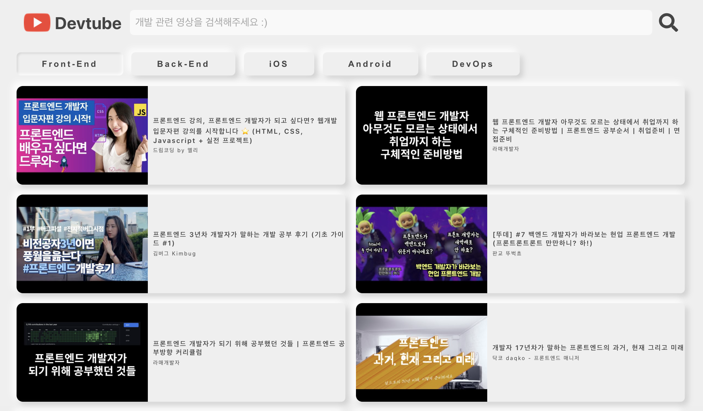
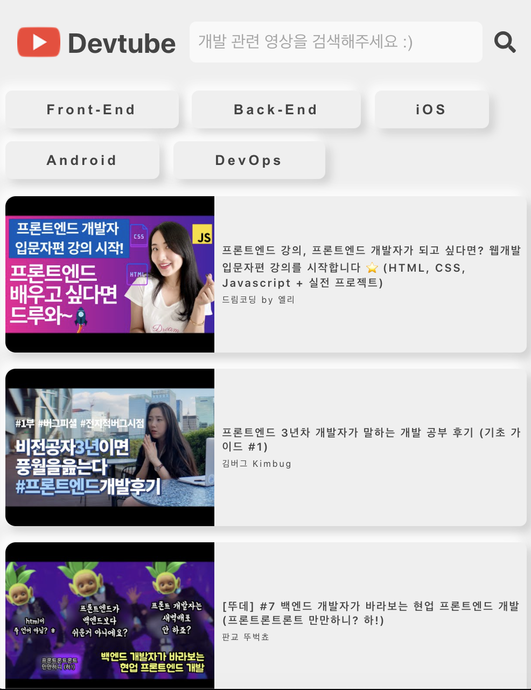

# DevTube ver.1.0
Youtube Clone Project(React.js)
[DevTube](https://charlie-devtube.netlify.app)

## Introduction

개발 정보를 얻기 위해 유튜브에 접속하지만, 다른 매력적인 영상 추천으로 유혹당해 시간을 낭비하는 일을 방지하기 위해 만든 웹 서비스입니다. 유튜브 API를 연동하여 개발 관련 영상을 보여주고, 키워드 검색 및 비디오 재생 기능이 있는 상세페이지를 개발하였습니다.

Video Web Service for those who want to stop getting distracted by and wasting time watching recommended videos from youtube. It will help you to watch only videos related to software development.

## Tech Stack

## Feature

1. 랜덤으로 개발 관련 검색 키워드로 영상을 뿌려주는 메인 페이지

2. 원하는 개발 키워드로 쉽게 검색할 수 있는 태그

3. 검색

4. 상세페이지

5. 반응형 지원

</img>

* React Hook
* PostCSS 모듈화 - CSS Module
* Restful APIs
* Youtube APIs
* Postman
* Axios
* Dependency Injection
* Deploy Using Netlify
